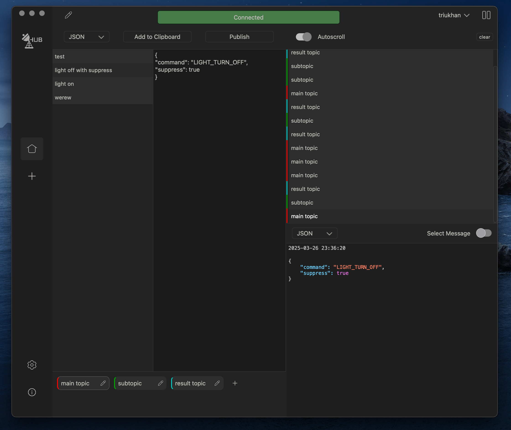

  

<strong>MQTT HUB</strong> - is full completed client that can help you to intercat with with different versions of MQTT protocol.
Designed and developed for debugging.

This project is considering as pet project, but it can be used as useful tool for debugging your IoT service.
GUI was developed using PyQt5. MQTT connection was made by paho.

